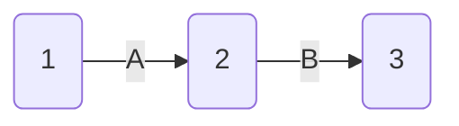

## 图与复杂网络

### 原理部分——建模

#### 图论

**特点：**

- 它们的目的都是从若干可能的安排或方案中寻求某种意义下的最优安排或方案，数学上把这种问题称为最优化或优化（optimization）问题
- 是它们都易于用图形的**形式直观地**描述和表达，数学上把这种与图相关的结构称为**网络**（network）
- 由于多数网络优化问题是以网络上的流（flow）为研究的对象，因此网络优化又常常被称为网络流（network flows）或网络流规划等

##### 基本概念

1. 无向图
   - 边上赋权的无向图称为赋权无向图或无向网络（undirected network）。我们对图和网络**不作严格**区分，因为任何图总是可以赋权的
   - 端点重合为一点的边称为环(loop)
   - 一个图称为简单图(simple graph)，如果它既没有环也没有两条边连接同一对顶点
2. 有向图
3. 完全图、二分图、子图
   每一对不同的顶点都有一条边相连的**简单图**称为完全图(complete graph)
4. 顶点的度
   - $\sum_{v \in V}d(v)=2 \epsilon$
   - 任何一个图的奇度点是偶数

##### 图与网络的数据结构

###### 邻接矩阵表示法

1. 描述的是顶点之间的关系，仅用于简单图

2. 对于无序图邻接矩阵是一个**对称矩阵**

3. 一个重要定理：

   > 设 $A(G)$ 为图 $G$ 的邻接距阵，则 $G$ 中从顶点 $v_i$ 到顶点 $v_j$，长度为 $k$ 的道路的条数为 $ A^k$ 中的 $i$ 行 $j$ 列元素
   >
   > > 应用数学归纳法易证，这也是复杂网络中通常的求法

4. 缺点：如果网络比较**稀疏**，这种表示法浪费大量的存储空间，从而增加了在网络中查找弧的时间

###### 稀疏矩阵表示法

1. 稀疏矩阵是指矩阵中零元素很多，非零元素很少的矩阵
2. 对于稀疏矩阵，只要存放非零元素的行标、列标、非零元素的值即可。
3. 在Matlab中无向图和有向图邻接矩阵的使用上有很大差异
   * 对于有向图，只要写出邻接矩阵，直接使用Matlab的命令 `sparse` 命令，就可以把邻接矩阵转化为稀疏矩阵的表示方式
   * 对于无向图，由于邻接矩阵是**对称阵**，Matlab中只需使用邻接矩阵的下三角元素，即 Matlab 只存储邻接矩阵下三角元素中的非零元素
   * 稀疏矩阵**只是**一种**存储**格式。Matlab中，普通矩阵使用sparse命令变成稀疏矩阵，稀疏矩阵使用full命令变成普通矩阵

##### 应用

###### 指定顶点间最短路问题

1. 两个**指定**顶点之间的最短路径

   定义 $W=(w_{ij})_{n \times n}$ 为赋权邻接矩阵。两定点不相邻时其分量为 $\infty$,设决策变量为 $x_{ij}$，$x_{ij}=1$说明 $v_iv_j$ 位于最短路上，从 $x_1$ 到 $x_n$ 的最短路**数学规划**表达式：
   $$
   min \quad \sum_{v_i,v_j \in E}{w_{ij}x_{ij}} \notag \\
   s.t. \quad \sum\limits_{\mathop {j = 1}\limits_{v_i,v_j\in E}}^n  {x_{ij}}-\sum\limits_{\mathop {j = 1}\limits_{v_j,v_i\in E}}^n  {x_{ji}}=
   \left\{ \begin{array}{l}
   1,\quad &i = 1\\
    - 1,\quad & i = n\\
   0,\quad& i \ne 1,n
   \end{array} \right.
   $$

   > 上述约束说的是只有首末两个点只有一出一进，中间的点一进一出，故而差为 0 

   可见这其实是一个**线性规划**

   > 给出了一个连接若干个城镇的铁路网络，在这个网络的两个指定城镇间，找一条最短铁路线 

   - 问题就是求赋权图 $ G$ 中指定的两个顶点 $u_0,v_0$ 间的具最小权的轨。这条轨叫做$u_0,v_0$ 间的最短路，它的权叫做 $u_0,v_0$ 间的距离，亦记作 $d(u_0,v_0)$

   - 算法——迪杰斯特拉（Dijkstra）

     其基本思想是按距 $u_0$ 从近到远为顺序，依次求得 $u_0$ 到 $G$ 的各顶点的最短路和距离

     ```matlab
     function[mydistance,mypath]=mydijkstra(a,sb,db);
     % 输入：a—邻接矩阵(aij)是指i到j之间的距离，可以是有向的
     % sb—起点的标号,db—终点的标号
     % 输出：mydistance—最短路的距离,mypath—最短路的路径
     n=size(a,1); visited(1:n) = 0;
     distance(1:n) = inf; % 保存起点到各顶点的最短距离
     distance(sb) = 0; parent(1:n) = 0;
     for i = 1: n-1
     temp=distance;
     id1=find(visited==1); %查找已经标号的点
     temp(id1)=inf; %已标号点的距离换成无穷
     [t, u] = min(temp); %找标号值最小的顶点
     visited(u) = 1; %标记已经标号的顶点
     id2=find(visited==0); %查找未标号的顶点
     for v = id2
     if a(u, v) + distance(u) < distance(v)
     distance(v) = distance(u) + a(u, v); %修改标号值
     parent(v) = u;
     end
     end
     end
     mypath = [];
     if parent(db) ~= 0 %如果存在路!
     t = db; mypath = [db];
     while t ~= sb
     p = parent(t);
     mypath = [p mypath];
     t = p;
     end
     end
     mydistance = distance(db);
     return
     ```

   > 缺点：但是一般迪杰斯特算法需要便利所有节点，效率较低

###### 顶点对之间的最短路径

1. 计算赋权图中各对顶点之间最短路径，显然可以调用 Dijkstra 算法。具体方法是：每次以不同的顶点作为起点，用Dijkstra 算法求出从该起点到其余顶点的最短路径，**反复**执行n −1次这样的操作，就可得到从每一个顶点到其它顶点的最短路径。这种算法的时间复杂度为$O(n^3 )$。第二种解决这一问题的方法是由 Floyd R W 提出的算法，称之为Floyd 算法
2. 基本思想：递推产生一个矩阵序列 $A_0 , A_1 \cdots A _k\cdots A_n$ ,其中 $A_k  (i, j)$ 表示从顶点 $v_i$  到顶点 $v_j$ 的路径上所经过的顶点序号不大于 $k$ 的最短路径长度。计算时用迭代公式：

$$
A_k(i,j)=min\{A_{k-1}(i,j),A_{k-1}(i,k)+A_{k-1}(k,j)\} \notag
$$

   $k​$ 是迭代次数, $i, j,k = 1,2,\cdots n​$

1. 通用代码

   ```matlab
   function [dist,mypath]=myfloyd(a,sb,db);
   % 输入：a—邻接矩阵(aij)是指i到j之间的距离，可以是有向的
   % sb—起点的标号；db—终点的标号
   % 输出：dist—最短路的距离；% mypath—最短路的路径
   n=size(a,1); path=zeros(n);
   for i=1:n
   for j=1:n
   if a(i,j)~=inf
   path(i,j)=j; %j是i的后续点
   end
   end
   end
   for k=1:n
   for i=1:n
   for j=1:n
   if a(i,j)>a(i,k)+a(k,j)
   a(i,j)=a(i,k)+a(k,j);
   path(i,j)=path(i,k);
   end
   end
   end
   end
   dist=a(sb,db);
   mypath=sb; t=sb;
   while t~=db
   temp=path(t,db);
   mypath=[mypath,temp];
   t=temp;
   end
   return
   ```

> Floyd 算法利用的是动态规划的思想

###### 最小生成树算法

**prim算法**构造最小生成树

```matlab
clc;clear;
a=zeros(7);
a(1,2)=50; a(1,3)=60;
a(2,4)=65; a(2,5)=40;
a(3,4)=52;a(3,7)=45;
a(4,5)=50; a(4,6)=30;a(4,7)=42;
a(5,6)=70;
a=a+a';a(find(a==0))=inf;
result=[];p=1;tb=2:length(a);
while length(result)~=length(a)-1
temp=a(p,tb);temp=temp(:);
d=min(temp);
[jb,kb]=find(a(p,tb)==d);
j=p(jb(1));k=tb(kb(1));
result=[result,[j;k;d]];p=[p,k];tb(find(tb==k))=[];
end
result
```

Kruskal 算法构造最小生成树

```matlab
clc;clear;
a(1,2)=50; a(1,3)=60; a(2,4)=65; a(2,5)=40;
a(3,4)=52;a(3,7)=45; a(4,5)=50; a(4,6)=30;
a(4,7)=42; a(5,6)=70;
[i,j,b]=find(a);
data=[i';j';b'];index=data(1:2,:);
loop=max(size(a))-1;
result=[];
while length(result)<loop
temp=min(data(3,:));
flag=find(data(3,:)==temp);
flag=flag(1);
v1=index(1,flag);v2=index(2,flag);
if v1~=v2
result=[result,data(:,flag)];
end
index(find(index==v2))=v1;
data(:,flag)=[];
index(:,flag)=[];
end
result
```

工具箱求解生成树并可视化：

```matlab
clc, clear
a=zeros(9);
a(1,[2:9])=[2 1 3 4 4 2 5 4];
a(2,[3 9])=[4 1]; a(3,4)=1; a(4,5)=1;
a(5,6)=5; a(6,7)=2; a(7,8)=3; a(8,9)=5;
a=a';  %转成Matlab需要的下三角元素
a=sparse(a);  %转换为稀疏矩阵
b=graphminspantree(a)
L=sum(sum(b))  %求最小生成树的权重
view(biograph(b,[],'ShowArrows','off','ShowWeights','on'))  %画最小生成树
```


###### 匹配问题

实现**匈牙利算法** 

> 见 /数学原理/数学建模算法与应用.pdf 图论章节

###### 邮递员问题——走完边

**中国邮递员问题**

上述中国邮递员问题的数学模型是：在一个赋权连通图上求一个含所有边的回路，且使此回路的权最小。显然，若此连通赋权图是**Euler**图，则可用**Fleury**算法求Euler回路，此回路即为所求。

对于非Euler图，1973年，Edmonds和Johnson给出下面的解法见

>  见 /数学原理/数学建模算法与应用.pdf  96页

**多邮递员问题**

邮局有$k(k\ge 2)$位投递员，同时投递信件，全城街道都要投递，完成任务返回邮局，如何分配投递路线，使得完成投递任务的时间最早？我们把这一问题记成 kPP。

请实现~

###### 旅行商（TSP）问题——走完点

用图论的术语说，就是在一个赋权完全图中，找出一个有最小权的Hamilton圈。称这种圈为最优圈。与最短路问题及连线问题相反，目前还没有求解旅行商问题的有效算法。所以希望有一个方法以获得相当好（但不一定最优）的解。一个可行的办法是首先求一个Hamilton圈 C，然后适当修改C以得到具有较小权的另一个Hamilton圈。修改的方法叫做**改良圈算法**

案例

> 从北京（Pe）乘飞机到东京(T)、纽约(N)、墨西哥城(M)、伦敦(L)、巴黎(Pa)五城市做旅游，每城市恰去一次再回北京，应如何安排旅游线，使旅程最短？各城市之间的航线距离如下表
>
> | 城市 |  L   |  M   |  N   |  Pa  |  Pe  |  T   |
> | :--: | :--: | :--: | :--: | :--: | :--: | :--: |
> |  L   |  0   |  56  |  35  |  21  |  51  |  60  |
> |  M   |  56  |  0   |  21  |  57  |  78  |  70  |
> |  N   |  35  |  21  |  0   |  36  |  68  |  68  |
> |  Pa  |  21  |  57  |  36  |  0   |  51  |  61  |
> |  Pe  |  51  |  78  |  68  |  51  |  0   |  13  |
> |  T   |  60  |  70  |  68  |  61  |  13  |  0   |

求解:

```matlab
function main
clc,clear
global a
a=zeros(6);
a(1,2)=56;a(1,3)=35;a(1,4)=21;a(1,5)=51;a(1,6)=60;
a(2,3)=21;a(2,4)=57;a(2,5)=78;a(2,6)=70;
a(3,4)=36;a(3,5)=68;a(3,6)=68; a(4,5)=51;a(4,6)=61;
a(5,6)=13; a=a+a'; L=size(a,1);
c1=[5 1:4 6];
[circle,long]=modifycircle(c1,L);
c2=[5 6 1:4];%改变初始圈，该算法的最后一个顶点不动
[circle2,long2]=modifycircle(c2,L);
if long2<long
long=long2;
circle=circle2;
end
circle,long
%*******************************************
%修改圈的子函数
%*******************************************
function [circle,long]=modifycircle(c1,L);
global a
flag=1;
while flag>0
flag=0;
for m=1:L-3
for n=m+2:L-1
if a(c1(m),c1(n))+a(c1(m+1),c1(n+1))<...
a(c1(m),c1(m+1))+a(c1(n),c1(n+1))
flag=1;
c1(m+1:n)=c1(n:-1:m+1);
end
end
end
end
long=a(c1(1),c1(L));
for i=1:L-1
long=long+a(c1(i),c1(i+1));
end
circle=c1;
```

###### 最大流问题

网络中的流

定义：在以 $V$ 为节点集， A为弧集的有向图 $G = (V, A)$上定义如下的权函数：

- $L: A\rightarrow R$为孤上的权函数，弧 $(i,j) \in A$ 对应的权 $L(i,j)$ 记为 $l_{ij}$，称为孤 $(i,j)$ 的容量下界（lower bound）
- $L:A\rightarrow R$ 为孤上的权函数，弧 $(i,j)\in A$ 对应的权 $U(i,j)$ 记为 $u_{ij}$，称为孤 $(i,j)$ 的容量上界，或直接称为容量（capacity）
- $D:V\rightarrow R$为顶点上的权函数，节点 $i∈V$ 对应的权 $D(i)$ 记为 $d_i$，称为顶点 $i$ 的供需量（supply/demand）

此时所构成的网络称为流网络，可以记为 $N=(V,A,L,U,D)$

由于给定有向图 $G=(V,A)$ 后，我们总是可以在它的弧集合和顶点集合上定义各种权函数，所以流网络一般也**直接**简称为网络


严格定义：对于流网络 $N=(V,A,L,U,D)$，其上的一个流 $(flow)f $ 是指从 $N$ 的弧集 $A$ 到 $R$ 的一个函数，即对每条弧 $(i,j)$ 赋予一个实数 $f_{ij}$ (称为弧 $(i,j)$ 的流量）。如果流 $f$ 满足:
$$
\sum_{j:(i,j)\in A}{f_{ij}}-\sum_{j:(j,i)\in A}{f_{ji}}=d_i,\quad \forall i \in V \tag{1} \\
l_{ij } \le f_{ij} \le u_{ij},\quad \forall  (i,j) \in A
$$
则称 $f$ 为可行流(feasible flow）。至少存在一个可行流的流网络称为可行网络（feasible network)。（1）约束即流量守恒条件（也称流量平衡条件），下面的约束称为容量约束。

- $d_i>0$ 则是源点（Source）
- $d_i<0$ 则是汇点（Sink）
- $d_i=0$ 即是平衡点

   对于可行网络，必有
$$
\sum_{i \in V}{d_i}=0 \notag
$$
  一般来说，我们总是可以把 $L\ne 0$ 的流网络转化为 $L = 0$ 的流网络进行研究。所以，除非特别说明，以后我们总是假设 $L=0$ (即**容量下界为0**)

**最大流问题**

考虑如下流网络 $N = (V, A,U,D)：$ 节点 $s$ 为网络中**唯一**的源点，$t$ 为**唯一**的汇点，而其它节点为转运点。如果网络中存在可行流 $f$，此时称流$f$的流量（或流值，flow value）为$d_s$（根据（3），它自然也等于$-d_t$ ），通常记为 $v$ 或 $v(f)$ ，即
$$
v=v(f)=d_s=-d_t  \notag
$$
对这种**单源单汇**的网络，如果我们并不给定流量，则网络一般记为  $N=(s,t,V,A,U)$。最大流问题（maximum flow problem）就是在 $N=(s,t,V,A,U)$ 中找到流值最大的可行流（即最大流）。

用线性规划的方法，最大流问题可以形式地描述如下：
$$
max \quad v \\
s.t. \quad \sum_{j:(i,j)\in A}{f_{ij}}-\sum_{j:(j,i)\in A}{f_{ji}}=\left\{ \begin{array}{l}
v, \quad & i=s\\
-v, \quad &i=t\\
0,\quad& t \ne s,t
\end{array} \right. \notag  \\
0 \le f_{ij} \le u_{ij},\quad \forall (i,j) \in A
$$

> 定义: 如果一个矩阵 $A$的任何子方阵的行列式的值都等于0，1或−1，则称 A是全幺模的(totally unimodular TU，又译为全单位模的)，或称A 是全幺模矩阵

 整流定理：最大流问题所对应的**约束矩阵**是全幺模矩阵。若所有弧**容量**均为正整数，则问题的**最优解**为整数解。

> 最大流问题是一个特殊的线性规划问题。我们将会看到利用图的特点，解决这个问题的方法较之线性规划的一般方法要方便、直观得多


**最大流的一种算法—标号法**

标号法是由Ford和Fulkerson在1957年提出的。用标号法寻求网络中最大流的基本思想是寻找可增广轨，使网络的流量得到增加，直到最大为止。即首先给出一个初始流，这样的流是存在的，例如零流。如果存在关于它的可增广轨，那么调整该轨上每条弧上的流量，就可以得到新的流。对于新的流，如果仍存在可增广轨，则用同样的方法使流的值增大，继续这个过程，直到网络中不存在关于新得到流的可增广轨为止，则该流就是所求的最大流。

Ford-Fulkerson算法案例

```matlab
clc,clear
u(1,2)=1;u(1,3)=1;u(1,4)=2;u(2,3)=1;u(2,5)=2;
u(3,5)=1;u(4,3)=3;u(4,5)=3;
f(1,2)=1;f(1,3)=0;f(1,4)=1;f(2,3)=0;f(2,5)=1;
f(3,5)=1;f(4,3)=1;f(4,5)=0;
n=length(u);list=[];maxf(n)=1;
while maxf(n)>0
maxf=zeros(1,n);pred=zeros(1,n);
list=1;record=list;maxf(1)=inf;
%list是未检查邻接点的标号点，record是已标号点
while (~isempty(list))&(maxf(n)==0)
flag=list(1);list(1)=[];
label1= find(u(flag,:)-f(flag,:));
label1=setdiff(label1,record);
list=union(list,label1);
pred(label1)=flag;
maxf(label1)=min(maxf(flag),u(flag,label1)...
-f(flag,label1));
record=union(record,label1);
label2=find(f(:,flag));
label2=label2';
label2=setdiff(label2,record);
list=union(list,label2);
pred(label2)=-flag;
maxf(label2)=min(maxf(flag),f(label2,flag));
record=union(record,label2);
end
if maxf(n)>0
v2=n; v1=pred(v2);
while v2~=1
if v1>0
f(v1,v2)=f(v1,v2)+maxf(n);
else
v1=abs(v1);
f(v2,v1)=f(v2,v1)-maxf(n);
end
v2=v1; v1=pred(v2);
end
end
end
f
```

工具箱求解与可视化

```matlab
clc, clear
a=zeros(6);
a(1,[2 4])=[8 7]; a(2,[3 4])=[9 5]
a(3,[4 6])=[2 5]; a(4,5)=9; a(5,[3 6])=[6 10];
a=sparse(a);  %转化成稀疏矩阵
[c,d]=graphmaxflow(a,1,6)  %求最大流
view(biograph(d,[],'ShowArrows','on','ShowWeights','on'))  %画出最大流

```


###### 最小费用流及其求法

在运输网络$N=(s,t,V,A,U)$中，设 $c_{ij}$ 是定义在$A$上的非负函数，它表示通过弧$(i,j)$单位流的费用。所谓最小费用流问题就是从发点到收点怎样以最小费用输送一**已知量**为 $v(f)$ 的总流量

最小费用流问题可以用如下的线性规划问题描述：
$$
min  \quad \sum_{(i,j) \in A}{c_{ij}f_{ij}} \\
s.t. \quad\sum_{j:(i,j)\in A}{f_{ij}}-\sum_{j:(j,i)\in A}{f_{ji}}=\left\{ \begin{array}{l}
v(f), \quad & i=s\\
-v(f), \quad &i=t\\
0,\quad& t \ne s,t
\end{array} \right. \notag  \\
0 \le f_{ij} \le u_{ij},\quad \forall (i,j) \in A
$$
显然，如果 $v( f )$  $=$ 最大流  $v(f_{max})$ ，则本问题就是最小费用最大流问题。如果$v( f )$ >最大流 $v(f_{max})$ ，则本问题无解

**求最小费用流的一种方法—迭代法**

这个方法是由 Busacker 和Gowan在1961 年提出的。

案例：编写了最小费用最大流函数 mincostmaxflow，其中**调用了**利用Floyd算法求最短路的函数 floydpath

```matlab
function mainexample19
clear;clc;
global M num
c=zeros(6);u=zeros(6);
c(1,2)=2;c(1,4)=8;c(2,3)=2;c(2,4)=5;
c(3,4)=1;c(3,6)=6;c(4,5)=3;c(5,3)=4;c(5,6)=7;
u(1,2)=8;u(1,4)=7;u(2,3)=9;u(2,4)=5;
u(3,4)=2;u(3,6)=5;u(4,5)=9;u(5,3)=6;u(5,6)=10;
num=size(u,1);M=sum(sum(u))*num^2;
[f,val]=mincostmaxflow(u,c)
%定义求最短路径函数
function path=floydpath(w);
global M num
w=w+((w==0)-eye(num))*M;
p=zeros(num);
for k=1:num
for i=1:num
for j=1:num
if w(i,j)>w(i,k)+w(k,j)
w(i,j)=w(i,k)+w(k,j);
p(i,j)=k;
end
end
end
end
if w(1,num) ==M
path=[];
else
path=zeros(num);
s=1;t=num;m=p(s,t);
while ~isempty(m)
if m(1)
s=[s,m(1)];t=[t,t(1)];t(1)=m(1);
m(1)=[];m=[p(s(1),t(1)),m,p(s(end),t(end))];
else
path(s(1),t(1))=1;s(1)=[];m(1)=[];t(1)=[];
end
end
end
%定义最小费用最大流函数
function [flow,val]=mincostmaxflow(rongliang,cost,flowvalue);
%第一个参数：容量矩阵；第二个参数：费用矩阵；
%前两个参数必须在不通路处置零
%第三个参数：指定容量值（可以不写，表示求最小费用最大流）
%返回值flow 为可行流矩阵,val 为最小费用值
global M
flow=zeros(size(rongliang));allflow=sum(flow(1,:));
if nargin<3
flowvalue=M;
end
while allflow<flowvalue
w=(flow<rongliang).*cost-((flow>0).*cost)';
path=floydpath(w);%调用floydpath 函数
if isempty(path)
val=sum(sum(flow.*cost));
return;
end
theta=min(min(path.*(rongliang-flow)+(path.*(rongliang-flow)==0).*M));
theta=min([min(path'.*flow+(path'.*flow==0).*M),theta]);
flow=flow+(rongliang>0).*(path-path').*theta;
allflow=sum(flow(1,:));
end
val=sum(sum(flow.*cost));
```

###### 计划评审方法和关键路线法

计划评审方法（program evaluation and review technique, PERT）和关键路线法（critical path method, CPM）是网络分析的重要组成部分，它广泛地用于系统分析和项目管理。计划评审与关键路线方法是在20世纪50年代提出并发展起来的，1956年，美国杜邦公司为了协调企业不同业务部门的系统规划，提出了关键路线法。1958年，美国海军武装部在研制“北极星”导弹计划时，由于导弹的研制系统过于庞大、复杂，为找到一种有效的管理方法，设计了计划评审方法。由于PERT与CPM既有着相同的目标应用，又有很多相同的术语，这两种方法已合并为一种方法，在国外称为PERT/CPM，在国内称为**统筹方法**（scheduling method）

###### 计划评审与关键路径

定义：称任何消耗时间或资源的行动称为作业。称作业的开始或结束为事件，事件本身不消耗资源

在计划网络图中通常用圆圈表示事件，用箭线表示工作，1，2，3表示事件， A, B 表示作业。由这种方法画出的网络图称为计划网络图



虚工作用虚箭线 “……→” 表示。它表示工时为零，不消耗任何资源的虚构工作。其作用只是为了正确表示工作的前行后继关系。

定义：在计划网络图中，称从**初始事件到最终事件**的由各项工作连贯组成的一条路为路线。具有**累计作业时间最长**的路线称为**关键路线**


见小黄书

**实例：钢管订购与运输**

> 要铺设一条 $A_1 \rightarrow A_2\rightarrow \cdots\rightarrow A_{15}$的输送天然气的主管道, 经筛选后可以生产这种主管道钢管的钢厂有$S_1.S_2,\cdots,S_7$。图中粗线表示铁路，单细线表示公路，双细线表示要铺设的管道。具体参数参见120页
>
> （1）请制定一个主管道钢管的订购和运输计划，使总费用最小（给出**总费用**)。
> （2）请就（1）的模型分析：哪个钢厂钢管的销价的变化对购运计划和总费用**影响最大**，哪个钢厂钢管的**产量的上限**的变化对购运计划和总费用的影响最大，并给出相应的数字结果。
> （3）如果要铺设的管道不是一条线，而是一个树形图，铁路、公路和管道构成网络，请就这种更一般的情形给出一种**解决办法**，并按（1）的要求给出模型和结果。

1. 符号规范：

   记第$i$个钢厂的最大供应量为$s_i$，从第$i$个钢厂到铺设节点$j$的订购和运输费用为$c_{ij}$；用$l_j$表示管道第$j$段需要铺设的钢管量。$x_{ij}$是从钢厂$i$运到节点$j$的钢管量，$y_j$是从节点$j$向左铺设的钢管量，$z_j$是从节点$j$向右铺设的钢管量

2. **运费矩阵**的计算模型

   购买单位钢管及从$S_i（i=1,2,\cdots,7）$运送到$A_j（j=1,2,\cdots,15）$的最小购运费用$c_{ij}$的计算：

   - 计算铁路任意两点间的最小运输费用

     > 由于铁路运费不是连续的，故不能直接用Floyd算法来计算最小运输费用。但可以用Floyd算法来计算任意两点间的最短铁路**距离值**，再依据题中的铁路运价表，来计算最小运输费用。这就巧妙的避开铁路运费不是连续的问题

   - 计算公路任意两点间的最小运输费用

   - 计算任意两点间的最小运输费用

     > 由于可以用铁路、公路**交叉运送**，所以任意相邻两点间的最小运输费用为铁路、公路两者最小运输费用的最小值

3. 总费用的数学规划模型

$$
min  \quad\sum_{i=1}^7\sum_{j=1}^{15}c_{ij}x_{ij}+\frac{0.1}{2}\sum_{j=1}^{15}(z_j(z_j+1)+y_j(y_j+1))  \notag \\
\begin{align}
s.t. \quad \sum_{j=1}^{15}x_{ij} \in\{0\} \bigcup[500,s_i] \quad &  i = 1,2,\cdots,7 \notag \\
y_{j+1}+z_j=l_j \quad  & j=1,2,\cdots,14  \notag\\
x_{ij} \ge0,z_j \ge0,y_j \ge 0 \quad &  i=1,2,\cdots,7 ,j=1,2, \cdots,15  \notag\\
y_1=z_{15}=0\notag
\end{align}
$$

当管道为树形图时，建立与上面类似的非线性规划模型
$$
min  \quad\sum_{i=1}^7\sum_{j=1}^{21}c_{ij}x_{ij}+0.05\sum_{j=1}^{21} \sum_{(jk)\in E}(y_{jk}^2+y_{jk})  \notag \\
\begin{align}
s.t. \quad   500f_i \le \sum_{j=1}^{21}x_{ij } \le x_i f_i, \quad &  i = 1,2,\cdots,7 \notag \\
\sum_{i-1}^7x_{ij}=\sum_{(jk)\in E}y_{jk}, \quad  & j=1,2,\cdots,21 \notag\\
\qquad   \quad  y_{jk}+y_{kj}=l_{jk},x_{ij},y_{jk} \ge0 \notag
\end{align}
$$

##### MATLAB图论工具箱

Matlab图论工具箱的命令见下表

|         命令名          |                        功能                        |
| :---------------------: | :------------------------------------------------: |
| `graphallshortestpaths` |         求图中所有**顶点对**之间的最短距离         |
|     `graphconncomp`     | 找无向图的**连通分支**，或有向图的强（弱）连通分支 |
|   `graphisomorphism`    |    确定两个图是否**同构**，同构返回1，否则返回0    |
|    `graphisspantree`    |   确定一个图是否是**生成树**，是返回1，否则返回0   |
|     `graphmaxflow`      |               计算有向图的**最大流**               |
|   `graphminspantree`    |               在图中找**最小生成树**               |
|    `graphpred2path`     |          把前驱顶点序列变成路径的顶点序列          |
|   `graphshortestpath`   | 求图中指定的一对顶点间的最短**距离**和最短**路径** |
|    `graphtopoorder`     |              执行有向无圈图的拓扑排序              |
|     `graphtraverse`     |       求从一顶点出发，所能遍历图中的**顶点**       |

------

#### 复杂网络

ER **随机图** 模型中，任意两个节点中间有一条边的概率都为 $p$ 。因此，一个含有 $N$ 个节点的随机图中边的总数是一个期望值为 $p(N(N-1)/2)$ 的随机变量。这一理论被认为开创了复杂网络理论的系统性研究。

##### 统计描述

###### 基本特征

节点的度 $k_i$ 即与该节点连接的边数。节点度越大就越重要。网络的平均度定义为：
$$
<k>=\frac{1}{N}\sum_{i=1}^Nk_i
$$
度分布 $P(k)$ 说的是网络中节点度数为 $k$ 的节点所占比咧，常见的有泊松分布和幂律分布（只有少部分点度数很高），但是后者居多。

> 由于幂指数函数在双对数坐标中是一条直线，这个分布与系统特征无关，所以该特性被称为无标度性质

累积度分布表示的是度不小于 $k$ 的概率分布
$$
P_k=\sum _{i=k}^{\infty} P(i)
$$
两节点中间距离的倒数常被称为之间的效率。网络中任意两个节点之间距离的最大值称为网络的直径
$$
D=\max \limits_{1 \le i<j \le N}d_{ij}
$$
**聚类系数：**节点 $v_i$ 的 $k_i$ 个邻居节点之间实际存在的边数 $E_i$ 和总得可能的边数之比
$$
C_i=\frac{E_i}{C_{k_i}^2}
$$
整个网络的聚类系数为所有点的聚类系数均值。

**介数：** 有写节点度虽小，但他可能却是两个社团的中间联络人，意义重大。节点的介数就是网络中所有的最短路径中经过该节点的数量比例。

**中心性：**节点度中心性、介数中心性等等。此处给出特征向量中心性的定义：

对于节点 $v_i$ ，令他的**中心性分值** $x_i$ **正比**于连到他的所有节点的中心性分值的总和，则
$$
x_i =\frac{1}{\lambda}\sum_{j=1}^Na_{ij}x_j
$$
$a_{ij} $ 为邻接矩阵。用向量描述，上式可以写成 $Ax=\lambda x$ 。但是要求特征向量的分量均为正数，而只有最大特征值才满足。可见 $x$ 由邻接矩阵最大特征值的特征向量决定。

**Pagerank 值**

记邻接矩阵为 $a_{ij} $ ，其**列和**和**行和**分别是 $c_j=\sum_{i=1}^Na_{ij}，r_j=\sum_{j=1}^Na_{ij}$  ，他们分别给出了页面 $j$ 的链入链接数和页面 $i$ 的链出连接数。将上网时页面的选择看成一个有限状态，离散过程的随机过程，其状态可用 Markov 链描述。定义转移概率矩阵 $T$：
$$
t_{ij}=\frac{1-d}{N}+d\frac{a_{ij}}{r_i}
$$
通常取 $d=0.85$ 。正则马尔科夫链存在平稳分布 $\boldsymbol{x}$ ,有
$$
\boldsymbol{T}^T\boldsymbol{x}=\boldsymbol{x} ,\quad\sum_{i=1}^Nx_i=1
$$
平稳分布即pagerank值是转移概率矩阵 $T$ 的最大特征值的归一化向量

```matlab
clc, clear
B=zeros(6);
B(1,2)=1; B(2,[3,4])=1;
B(3,[4:6])=1; B(4,1)=1;
B(5,6)=1; B(6,1)=1;
nodes={'1.alpha','2.beta','3.gamma','4.delta','5.rho','6.sigma'};
h=view(biograph(B,nodes,'ShowWeights','off','ShowArrows','on'))
h.EdgeType='segmented'; %边的连接为线段
h.LayoutType='equilibrium';
dolayout(h) %刷新图形
r=sum(B,2); n=length(B);
for i=1:n
    for j=1:n
        A(i,j)=0.15/n+0.85*B(i,j)/r(i);  %构造状态转移矩阵
    end
end
A %显示状态转移矩阵
[x,y]=eigs(A',1); %求最大特征值对应的特征向量
x=x/sum(x) %特征向量归一化
bar(x) %画PageRank值的柱状图

```


###### 各种网络模型

1. 规则网络：任意两个节点之间相连遵循既定的规则，通常每个节点的近邻数都相同。

   * 全局耦合网络：任意两点都有边直接相连
   * 最近邻耦合网络：每个点只与周围邻居相连
   * 星型网络

2. 随机网络：一些节点通过随机连接而组成的复杂网络

   * ER模型：从总的可能边随机选取 $M$ 条边

   * 二项式模型：给定 $n$ 个节点，每一对节点以概率 $p$ 进行连接。这时边数是一个二项分布的随机变量

     ```matlab
     function main
     global m n x y %定义全局变量
     clc, n=9; t=0:2*pi/n:2*pi; 
     m=nchoosek(n,2); %计算n个节点的完全图的边数m
     x=cos(t); y=sin(t); 
     axis([-1.1,1.1,-1.1,1.1])
     subplot(1,2,1),plot(x,y,'o','Color','k')
     subplot(1,2,2),hold on
     [i1,j1]=myfun(0.1)  %根据概率0.1,调用函数计算连边的地址,并画图
     figure, subplot(1,2,1), hold on
     [i2,j2]=myfun(0.15)  %根据概率0.15,调用函数计算连边的地址,并画图
     subplot(1,2,2), hold on
     [i3,j3]=myfun(0.25)  %根据概率0.25,调用函数计算连边的地址,并画图
     
     function [i,j]=myfun(p);%该函数根据给定的概率p,计算连边的节点i与j
     global m n x y %定义全局变量
     z=rand(1,m);  %生成m个随机数
     ind1=(z<=p); %找z中小于等于p的随机数，对应的地址将来连边
     ind2=squareform(ind1); %把0-1向量转换成邻接矩阵
     [i,j]=find(ind2); %求边的节点编号
     plot(x,y,'o','Color','k')
     for k=1:length(i)
       line([x(i(k)),x(j(k))],[y(i(k)),y(j(k))],'Color','k')
     end
     ```

   随机网络的性质：

   * **泊松度分布** （从二项分布可以推知）
   * 平均距离短
   * 聚类系数小

3. 小世界网络：完全规则网络到完全随机网络的**过渡**，尽管网络尺寸很大，但是任意节点之间却有一个较小的距离。先生成成环的规则图，每个点仅与左右相连的点连接，再随即重连。

   

4. 无标度网络:上述三种的共同特征便是网络的度分布为近似的泊松分布。为了解释幂律分布产生的机理，Barabasi 和 Albert 提出了 BA模型，他们认为许多网络模型没有考虑以下两个重要特性

   * 增长特性：即网络的规模是不断扩大的
   * 优先链接：即新的节点更倾向于与哪些度数高的节点链接。

   构造算法：

   1. 增长：从一个具有 $m_0$ 个节点的网络开始，每次引入一个新节点并且练到 $m$ 个已知的节点上，$m \le m_0$ 

   2. 优先链接：一个新节点与一个已经存在的节点 $v_i$ 相联接的概率与其度有如下关系
      $$
      \prod_i=\frac{k_i+1}{\sum \limits_{j}(k_j+1)}
      $$


   **仿真实验：**

   ```matlab
   clc, clear, hold on
   N=100; K=4; p=0.15; %N为网络节点总数,K为邻域节点个数,p为随机化加边概率
   t=0:2*pi/N:2*pi-2*pi/N;  %生成最近邻耦合网络各节点坐标的参数方程的角度
   x=100*sin(t); y=100*cos(t);
   plot(x,y,'ko','MarkerEdgeColor','k','MarkerFaceColor','r','markersize',6);
   A=zeros(N);    %邻接矩阵初始化
   for i=1:N      %该层循环构造最近邻K耦合网络的邻接矩阵
      for j=i+1:i+K/2
          jj=(j<=N)*j+(j>N)*mod(j,N); %如果j超过了N，取除以N的余数
          A(i,jj)=1; A(jj,i)=1;
      end
   end
   B=rand(N); B=tril(B); %产生随机数，并截取下三角部分
   C=zeros(N); C(B>=1-p)=1; C=C+C'; %C对应新产生边的完整邻接矩阵
   A=A|C; %做逻辑或运算，产生加边以后的邻接矩阵
   for i=1:N-1 
       for j=i+1:N
           if A(i,j)~=0
               plot([x(i),x(j)],[y(i),y(j)],'linewidth',1.2); 
           end
       end
   end
   Matlab_to_Pajek(A)  %生成Pajek数据，文件名为Pajek_data1.net
   
   ```


##### 复杂网络的传播模型与动力学分析

